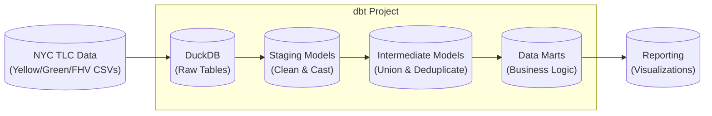

# NYC Taxi Rides Analytics

## Project Overview

This project transforms and analyzes NYC Taxi & Limousine Commission (TLC) trip record data using **dbt** (Data Build Tool) and **DuckDB**. It processes **Yellow**, **Green**, and **For-Hire Vehicle (FHV)** trip data to produce analytics-ready models for reporting.

### Architecture



## Local Setup Guide

### 1. Prerequisites

Ensure you have the following tools installed:

- [uv](https://github.com/astral-sh/uv) (Python package manager)
- [DuckDB CLI](https://duckdb.org/install/?platform=windows&environment=cli) (v0.10.0 or later recommended)

### 2. Install Dependencies
Install the Python environment and dependencies using `uv`:

```bash
uv sync
```

### 3. Configure dbt Profile

Unlike a standard dbt project, you do NOT need to run `dbt init`. Instead, configure your connection in `~/.dbt/profiles.yml`.

**Create or update `~/.dbt/profiles.yml` with the following configuration:**

```yaml
taxi_rides_ny:
  target: dev
  outputs:
    # DuckDB Development profile
    dev:
      type: duckdb
      path: taxi_rides_ny.duckdb
      schema: dev
      threads: 1
      extensions:
        - parquet
      settings:
        memory_limit: '4GB'
        preserve_insertion_order: false
        max_temp_directory_size: '100GB'

    # DuckDB Production profile
    prod:
      type: duckdb
      path: taxi_rides_ny.duckdb
      schema: prod
      threads: 1
      extensions:
        - parquet
      settings:
        memory_limit: '4GB'
        preserve_insertion_order: false
        max_temp_directory_size: '100GB'
```

> [!TIP]
> **Performance Tuning**:
> - `threads: 1`: Recommended for stability with large datasets in local DuckDB.
> - `memory_limit`: Set to '4GB' (or '2GB' if you have <8GB RAM).
> - `max_temp_directory_size`: Allows DuckDB to spill to disk during memory-intensive operations.

### 4. Download and Ingest Data

Load the raw NYC TLC data (2019-2020) into your local DuckDB database:

```bash
uv run data_ingestion.py nyc-tlc
```

Load the raw NYC FHV data (2019-) into your local DuckDB database (for Homework 2):

```bash
uv run data_ingestion.py nyc-fhv
```

### 5. Install dbt Packages

Install the required dbt packages (including `dbt-utils`):

```bash
uv run dbt deps
```

## Running the Project

### Test Connection

Verify dbt can connect to your DuckDB database:

```bash
uv run dbt debug
```

### Build Models

Run the entire pipeline (seeds, models, tests, snapshots):

```bash
uv run dbt build
```

> [!TIP]
> **Target Selection**:
> - `--target prod`: Use the production profile for building models.

> [!TIP]
> **Model Selection**:
> - `--select`: Select specific models to build.

> [!IMPORTANT]
> **Retrying Failed Models**:
> - `uv run dbt retry`: Retry failed models.

### Generate Documentation

Generate and view the project's documentation website:

```bash
uv run dbt docs generate
uv run dbt docs serve
```

## Data Lineage & Models

### Staging (`models/staging`)

Raw data is cleaned and cast to correct data types.

- `stg_yellow_tripdata`: Cleans raw yellow taxi data.
- `stg_green_tripdata`: Cleans raw green taxi data.
- `stg_fhv_tripdata`: Cleans raw FHV trip data (Homework).

### Intermediate (`models/intermediate`)

Data is standardized and prepared for business logic.

- `int_trips_unioned`: Unions yellow and green taxi data into a single stream.
- `int_trips`: Deduplicates data and adds surrogate keys for unique identification.

### Marts (`models/marts`)

Business-centric models optimized for analysis.

- `dim_vendors`: Vendor lookup table.
- `dim_zones`: Taxi zone lookup table.
- `fct_trips`: Final trip facts table joined with zone information.
- `reporting/fct_monthly_zone_revenue`: Aggregated monthly revenue by zone.
